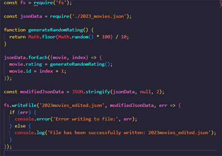
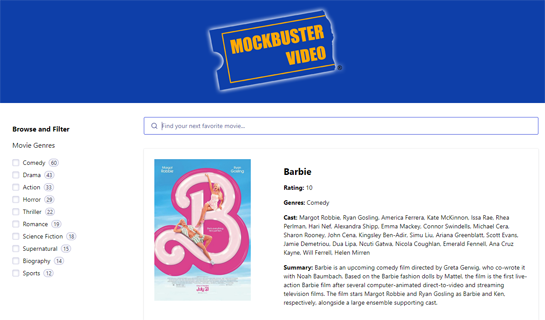
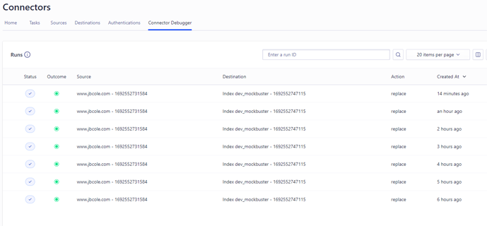

# Take Home Write Up: Jacob Cole (August 20, 2023)

Greetings, team! It's my pleasure to share with you my simple implementation of Algolia with "Mockbuster Video".

## THE PROJECT

When I first set out to implement Algolia, I started by examining the available datasets.

<https://github.com/algolia/datasets>

As a film fan, I gravitated toward "movies". Upon examination, the actors.json dataset was a little light on properties. I thought this might make meaningful indexing and search more difficult to demonstrate in my implementation. On the other hand, movies.json felt overkill in size for a simple implementation. So I decided to use a public dataset (i.e., movie data scraped from Wikipedia) and trim it to films from 2023. I felt this would provide a meaningful set of data that would also be lightweight for the purposes of a simple implementation.

However, I discovered this data set had a few flaws.

1. Film entries in the array were lacking an 'id', and my current understanding of Algolia is that the 'id' field is the relative minimum that all objects in a dataset should have.
2. Entries in the dataset were also lacking any opportunity to include a Custom Ranking attribute (e.g., "critics rating").

To address this deficit in the data, I created the script "addrating.js" to add both an arbitrary id and randomly generated film rating to allow for a numeric Custom Ranking.

## GOALS

For Mockbuster Video, I wanted to accomplish the following:

1. Create a retro tribute to everyone's favorite bygone video store. I wanted to make this implementation fairly realistic, as I anticipate prospective clients are wanting to see as branded a demo implementation as possible.
2. Implement elements of a contemporary UI.
3. Utilize a few additional features like Custom Ranking, Synonyms, and Filtering.
4. Create a mockup using the UI Demo feature and replicate it using the React InstantSearch library.
5. Automate indexing using Connectors.

To accomplish the overall aesthetic, I created graphics and customized the existing library's CSS to match the brand.

The library's React components were helpful in quickly rendering the UI.

Custom Ranking was accomplished using the randomly generated movie ratings. I did, however, give Barbie a perfect 10 manually through the dashboard.

Ideally and with more time, these would be actual ratings pulled using the IMDB, Rotten Tomatoes, or Metacritic APIs. A few Synonyms were added to link terms like "Funny" with the genre "Comedy" in search. Similarly, "Horror" and "Slasher" were given synonyms, as one is a subset of the other, and I noticed there were some films tagged as "Slasher", but they did not also have the "Horror" tag.

Filtering was added by film genre.

The UI Demo and final implementation share the same general aesthetic, although I did not get to implement the grid vs. list view.

Finally, automating indexing was accomplished using Connectors and a remotely-hosted JSON file.

## FEEDBACK

1. It may be my user error, but I could not get "Thriller" and "Suspense" synonym links to work in the same fashion as funny/comedy and slasher/horror.
2. I would consider sandboxing the interface with the quickstart and tutorial components unless a firstime user chooses to skip or hide those elements.
3. I also think it took me some time to find how to clear/delete my first test index after I realized my dataset was incomplete for my purposes. If I missed a tutorial or tooltip that illuminated that, my apologies. Otherwise, I would consider adding a tooltip that might prompt a user with something like "See any problems with your data? You can always start over by..."
