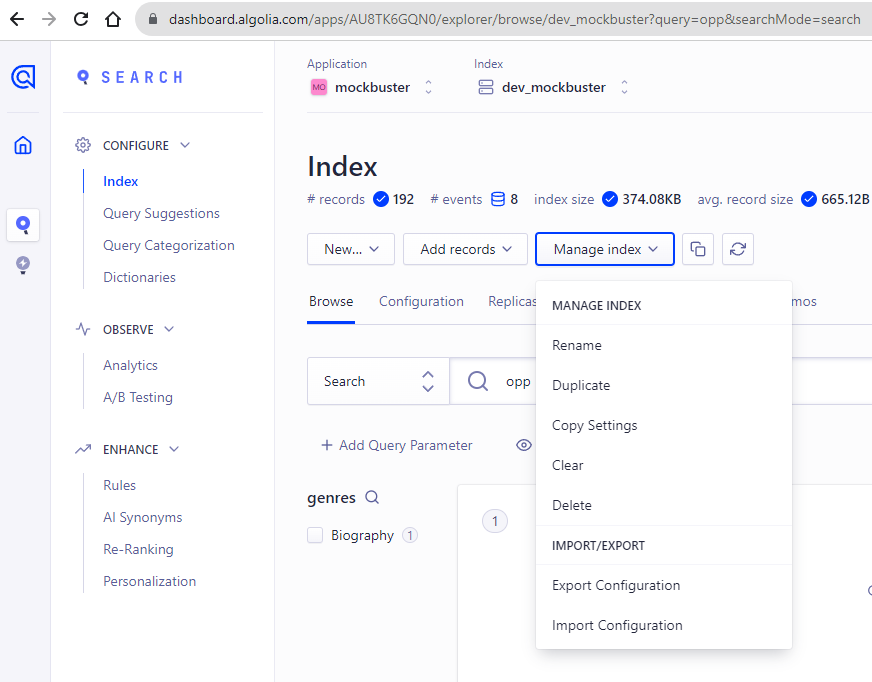
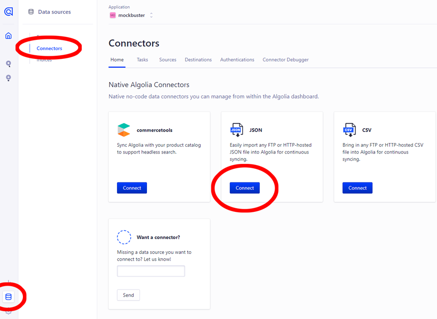

# Email Questions and Responses

## Question 1

Hello,

I'm new to search engines, and there are a lot of concepts I'm not educated on. To make my onboarding smoother, it'd help if you could provide me with some definitions of the following concepts:

Records
Indexing
I'm also struggling with understanding what types of metrics would be useful to include in the "Custom Ranking."

Cheers, George

## Reply 1

Greetings,

First and foremost, thank you so much, George, for reaching out with your questions. I'm more than happy to assist you.

A record is an individual entry that is a part of your overall data--like a single product in a catalog. On a more technical level, records are like the individual rows of an Excel spreadsheet. They often contain several pieces of information. For example, a product usually has a few bullets like name, price, rating, and description. We sometimes refer to these descriptors as "attributes" or "properties". Attributes like name and description are usually the terms your customers use to find products, and attributes like price and rating are usually used for filtering and sorting the results.

Indexing is how we order and make sense of all those records. An index is like a roadmap for all the records or data you have. We create indexes (or indices) for data so that records can be retrieved as quickly as possible. If your customers are typing in words that describe products, we want to quickly match those words with the right product and return the result. Indexing is how we do that. But don't worry about the technical details of indexing; our dashboards let you make a few key decisions about how you want to handle your data, and Algolia does the rest by building the index in the background.

As for metrics and Custom Ranking, think of it as a tiebreaker when a search returns multiple possible results. You can help to break that tie by specifying a field for Custom Ranking. In the case of products, you might sort by your most popular or highest rated products. For example, if a customer searches "iPhone", there may be several models available. You can provide a Custom Ranking that puts the highest rated models at the top. This helps to improve your customers' search experience as well as their overall satisfaction.

Thank you again, George, for asking these excellent questions! I'm going to put a few links under my signature if you want to read more on these topics.

If I can share more information or take some time to walk you through how these concepts work in Algolia, please don't hesitate to let me know! I'm happy to jump on a Zoom and walk you through the Dashboard.

Best regards,

Jacob Cole

Solutions Engineer

<https://www.algolia.com/doc/guides/managing-results/must-do/custom-ranking/>
<https://www.algolia.com/doc/guides/sending-and-managing-data/prepare-your-data/>

## Question 2

Hello,

Sorry to give you the kind of feedback that I know you do not want to hear, but I really hate the new dashboard design. Clearing and deleting indexes are now several clicks away. I am needing to use these features while iterating, so this is inconvenient.

Regards, Matt

## Reply 2

Matt,

I hope this email finds you well. Please rest assured that your feedback is vital for our improvement, so thank you very much for taking the time to voice the challenges you're working through with the platform. I'm going to share your thoughts with engineers on the product team internally. I completely understand that changes in the interface can present different challenges. However, I'd like to try to assist you in the meantime with some possible solutions.

If you're working with a single Index for an extended period of time, I've found it helpful to bookmark it for quick reference. From there, you're just two clicks away to Clear or Delete that Index.

Alternatively, if you'd like to have your Index regularly rebuilt with your latest dataset, consider using some of the built in Connectors functionality in the Dashboard. I recently connected an Index with a remote JSON file that gets updates at a frequency I set, which currently runs every hour. If you're interested, this screenshot will show you how to navigate to this feature for setup.

If neither of those solutions are effective for the current situation, I can help you write a script that uses the API to Delete an Index or Clear its Records. We can make it available at the push of a button.

<https://www.algolia.com/doc/guides/sending-and-managing-data/manage-indices-and-apps/manage-indices/how-to/delete-indices/?client=javascript/>

Thank you again for sharing your feedback. It's critical in helping us to improve the platform. If I can assist you further with one of the solutions here, please don't hesitate to let me know.

Best regards,

Jacob Cole

Solutions Engineer

## Question 3

Hi,

I'm looking to integrate Algolia in my website. Will this be a lot of development work for me? What's the high level process look like?

Regards, Leo

## Reply 3

Greetings, Leo!

Thank you so much for reaching out with your questions. While implementations can vary in complexity, it can be as simple as a few clicks and importing some of our predefined libraries.

I always recommend new users take a look at the following 1-minute video first to get a grasp of what a simple implementation can look like in just 3 steps.

<https://www.youtube.com/watch?v=yA4KISBv_88/>

From there, Algolia has integrations with all the most popular web and mobile technologies--over 40 in total.

<https://www.algolia.com/developers/integrations/>

We also have InstantSearch libraries with ready-made UI compoments for vanilla JavaScript, React, Vue, Angular, Android, and iOS.

If your implementation is more complex, I'm standing by to talk through how we can ease the lift on your end and get Algolia integrated into your platform as smoothly as possible.

May I ask what your current tech stack looks like? Let me know what you're running on, and I can start putting together solution to show you how easy implementing Algolia can be with your specific technology.

Alternatively, if you'd like to find an opportunity to talk in real time, feel free to grab some time on my calendar:

<http://calendly.com/insertmylinkhere/>

I look forward to hearing from you.

Best regards,

Jacob Cole

Solutions Engineer
